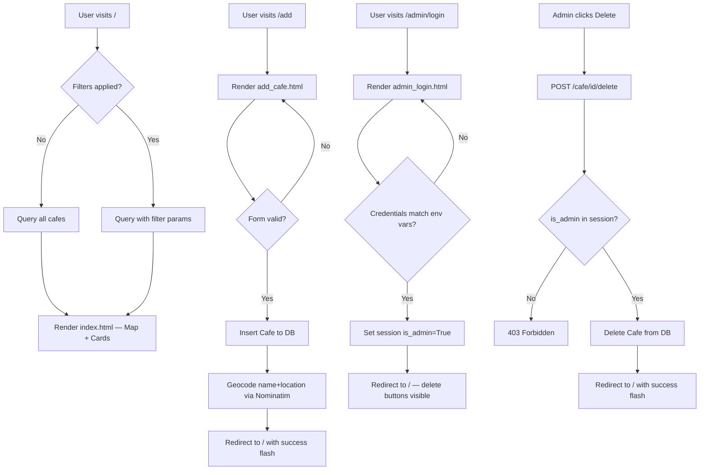

# Cafe & WiFi Finder — @rudil24

A community-maintained, filterable web app for remote workers to discover London cafes with the amenities that actually matter: WiFi, power sockets, and call-friendly environments.

## Estimated Cost

| Category | Description | Cost |
| --- | --- | --- |
| Development Labor | ~20 hrs @ $100/hr (OPST Agentic Team) | $2,000 |
| AI Tokens | Claude Pro subscription | ~$5.00 |
| Production Hosting | Render.com Web Service (free tier) + PostgreSQL | $0.00 |
| Other | n/a | $0.00 |
| __TOTAL__ | | __$2,005__ |

## Mockup

See [docs/Design.md](./docs/Design.md) for full wireframes.

## To Run

### On The Web

_Coming soon — deploying to Render.com_

### In Your Local Environment

1. `git clone` this repo to a local project folder
2. `pip install -r requirements.txt`
3. Consult `.env.example` for required environment variables; create your own `.env` file
4. `python geocode.py` — populates lat/lng for existing cafes (run once)
5. `flask run` or `python app.py`
6. Built in __Python 3.11__ — should work on any 3.8+

## Product Roadmap

See [docs/PRD.md](./docs/PRD.md) for full user stories and acceptance criteria.

### MVP (Must Do)

- [ ] Browse all cafes — interactive Leaflet/OpenStreetMap map + responsive card grid
- [ ] Filter cafes by WiFi, sockets, call-friendliness, and neighborhood
- [ ] Add a new cafe via public submission form (WTForms + CSRF)
- [ ] Admin login (env var credentials, session-based)
- [ ] Admin delete cafe (protected POST route)
- [ ] Tailwind CSS responsive design (mobile-first, single-column on small screens)
- [ ] PostgreSQL-compatible SQLAlchemy models (SQLite dev → Postgres prod)
- [ ] Deploy to Render.com with Gunicorn

### Stretch Goals (Should Do)

- [ ] Honeypot field on add form to reduce spam submissions
- [ ] Broken image URL fallback placeholder
- [ ] Shareable filter links (URL query params reflect active filters)
- [ ] Animate map → card cross-highlight on pin click

### Super-Stretch Goals (Could Do)

- [ ] Search cafes by name
- [ ] Thumbs-up / thumbs-down community rating per cafe
- [ ] Multiple city support beyond London

### Out of Scope (Won't Do)

- User accounts or registration for regular visitors
- Cafe owner login or claimed listings
- Reservation or booking features
- Payment or monetization

## Design

See [docs/Design.md](./docs/Design.md) for architecture diagram, data model, route map, wireframes, and deployment plan.

### Program Logic Flow

## Development Workflow

- [ ] 1. Initialize Flask app, SQLAlchemy config, `.env` wiring
- [ ] 2. Define `Cafe` model in `models.py` with `lat`/`lng` columns
- [ ] 3. Run `geocode.py` to populate lat/lng for existing 21 cafes
- [ ] 4. Build `GET /` route with filter logic and `index.html` template (cards only first)
- [ ] 5. Add Leaflet map to `index.html` with cafe pins from JSON context
- [ ] 6. Wire up filter chip bar (GET params → backend filter → template re-render)
- [ ] 7. Build `GET/POST /add` route and `add_cafe.html` with WTForms
- [ ] 8. Build `GET/POST /admin/login` and `GET /admin/logout` routes
- [ ] 9. Wire up `POST /cafe/<id>/delete` with admin session guard
- [ ] 10. Sentinel review — CSRF, input validation, session security
- [ ] 11. Stella polish — Tailwind responsive grid, amenity icons, flash banners, mobile layout
- [ ] 12. Vera QA — form validation tests, admin flow tests, mobile responsiveness check
- [ ] 13. Switch to PostgreSQL locally (`DATABASE_URL` env var) and verify schema
- [ ] 14. Deploy to Render.com — web service + env vars + DB seed
- [ ] 15. END-TO-END TEST on live Render URL
- [ ] 16. FULL DEPLOYMENT — portfolio ready

## Reflection

| DATE | COMMENTS |
| --- | --- |
| 2026-02-27 | Project kickoff complete. PRD, Design, README generated. Git initialized. Ready for Phase 1 development. |

## References

- [Laptop Friendly London](https://laptopfriendly.co/london) — UX inspiration
- [Leaflet.js](https://leafletjs.com/) — open-source interactive maps
- [Nominatim](https://nominatim.openstreetmap.org/) — free geocoding API
- [Tailwind CSS](https://tailwindcss.com/) — utility-first CSS framework
- [Flask-WTF](https://flask-wtf.readthedocs.io/) — WTForms Flask integration
- [Render.com Docs](https://render.com/docs) — deployment reference
