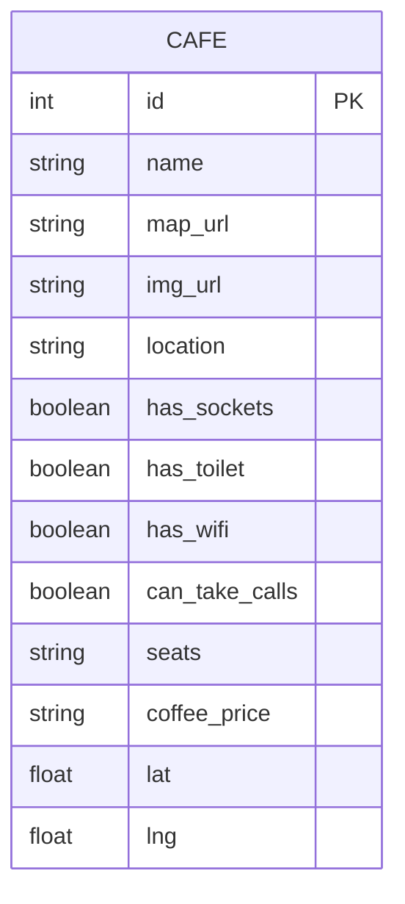

# Design Document: Cafe & WiFi Finder

| Metadata | Details |
| :--- | :--- |
| __Status__ | `Draft` |
| __Last Updated__ | 2026-02-27 |
| __PRD__ | [docs/PRD.md](./PRD.md) |

---

## 1. Architecture Overview


__Stack Summary:__

- __Language:__ Python 3.11+
- __Framework:__ Flask (server-rendered, Jinja2 templates)
- __ORM:__ Flask-SQLAlchemy
- __Forms:__ Flask-WTF (WTForms + CSRF)
- __Styling:__ Tailwind CSS (CDN)
- __Map:__ Leaflet.js (CDN) + OpenStreetMap tiles
- __Auth:__ Flask session + env var credentials (no Flask-Login)
- __WSGI:__ Gunicorn
- __Database:__ SQLite (dev) / PostgreSQL (prod)
- __Geocoding:__ Nominatim (OpenStreetMap, free, 1 req/sec max)

---

## 2. Project File Structure

```
cafe-wifi/
├── app.py                  # App factory, DB init, route registration
├── models.py               # SQLAlchemy Cafe model
├── forms.py                # WTForms CafeForm, AdminLoginForm
├── geocode.py              # One-time Nominatim geocoding script
├── requirements.txt        # Python dependencies
├── .env.example            # Environment variable template
├── .gitignore
├── .gitattributes
├── LOCAL_LOG.md
├── docs/
│   ├── PRD.md
│   └── Design.md
├── instance/
│   └── cafes.db            # SQLite dev database
├── static/
│   └── (empty for MVP — Tailwind and Leaflet via CDN)
└── templates/
    ├── base.html           # Shared layout: navbar, flash messages, footer
    ├── index.html          # Browse page: map + filter chips + card grid
    ├── add_cafe.html       # Add cafe form
    └── admin_login.html    # Admin login form
```

---

## 3. Data Model



__Notes:__

- `lat` and `lng` are nullable initially; populated by `geocode.py` migration script.
- No additional tables needed for MVP. Admin auth is env-var based (no `User` table).
- PostgreSQL production uses the same schema via SQLAlchemy `DATABASE_URL` env var.

---

## 4. Route Map

| Method | Route | Template | Auth Required |
| :--- | :--- | :--- | :--- |
| `GET` | `/` | `index.html` | No |
| `GET` | `/add` | `add_cafe.html` | No |
| `POST` | `/add` | redirect → `/` | No |
| `GET` | `/admin/login` | `admin_login.html` | No |
| `POST` | `/admin/login` | redirect → `/` | No |
| `GET` | `/admin/logout` | redirect → `/` | Yes (session) |
| `POST` | `/cafe/<id>/delete` | redirect → `/` | Yes (session) |

---

## 5. Wireframes

### View 1: Browse Page (Default / Public)

```
┌──────────────────────────────────────────────────────────────┐
│  🍵 CafeWifi                        [Add a Cafe] [Admin]    │  ← navbar
├──────────────────────────────────────────────────────────────┤
│  Filters: [All] [WiFi] [Sockets] [Calls]  Location: [All ▼] │  ← filter bar
├──────────────────────────────────────────────────────────────┤
│                                                              │
│   ┌────────────────────────────────────────────────────┐    │
│   │          Leaflet / OpenStreetMap                   │    │  ← map (full width)
│   │    📍        📍          📍      📍                │    │
│   │         📍         📍                              │    │
│   └────────────────────────────────────────────────────┘    │
│                                                              │
│  ┌───────────┐   ┌───────────┐   ┌───────────┐             │
│  │ [photo]   │   │ [photo]   │   │ [photo]   │             │  ← card grid
│  │ Cafe Name │   │ Cafe Name │   │ Cafe Name │             │     (3-col desktop)
│  │ Peckham   │   │ Shoreditch│   │ London Br │             │
│  │ 📶 🔌 📞  │   │ 📶 🔌     │   │ 📶        │             │
│  │ 30 seats  │   │ 50+ seats │   │ 20 seats  │             │
│  │ £2.75 ☕  │   │ £3.00 ☕  │   │ £2.40 ☕  │             │
│  └───────────┘   └───────────┘   └───────────┘             │
└──────────────────────────────────────────────────────────────┘
```

### View 2: Add Cafe Form

```
┌──────────────────────────────────────────────────────────────┐
│  🍵 CafeWifi                        [Add a Cafe] [Admin]    │
├──────────────────────────────────────────────────────────────┤
│                                                              │
│                    ➕ Add a New Cafe                         │
│                                                              │
│    Cafe Name *       [_________________________________]     │
│    Location *        [_________________________________]     │
│    Google Maps URL * [_________________________________]     │
│    Photo URL *       [_________________________________]     │
│    Seats             [_________________________________]     │
│    Coffee Price      [_________________________________]     │
│                                                              │
│    Amenities:                                                │
│    [✓] Has WiFi     [ ] Has Sockets    [ ] Has Toilet       │
│    [ ] Can Take Calls                                        │
│                                                              │
│                   [      Submit Cafe      ]                  │
│                                                              │
└──────────────────────────────────────────────────────────────┘
```

### View 3: Admin Login

```
┌──────────────────────────────────────────────────────────────┐
│  🍵 CafeWifi                        [Add a Cafe] [Admin]    │
├──────────────────────────────────────────────────────────────┤
│                                                              │
│                                                              │
│                    🔒 Admin Login                            │
│                                                              │
│              Username   [____________________]               │
│              Password   [____________________]               │
│                                                              │
│                       [     Log In     ]                     │
│                                                              │
│                                                              │
└──────────────────────────────────────────────────────────────┘
```

### View 4: Browse Page (Admin Mode)

```
┌──────────────────────────────────────────────────────────────┐
│  🍵 CafeWifi          [Add a Cafe] [Admin: logged in | Out] │  ← admin nav state
├──────────────────────────────────────────────────────────────┤
│  Filters: [All] [WiFi] [Sockets] [Calls]  Location: [All ▼] │
├──────────────────────────────────────────────────────────────┤
│   [Leaflet Map — same as public view]                        │
├──────────────────────────────────────────────────────────────┤
│  ┌───────────┐                                               │
│  │ [photo]   │                                               │
│  │ Cafe Name │  ← same card layout                          │
│  │ Peckham   │                                               │
│  │ 📶 🔌 📞  │                                               │
│  │ 30 seats  │                                               │
│  │ £2.75 ☕  │                                               │
│  │ [🗑 Delete]│  ← admin-only delete button (red, POST form) │
│  └───────────┘                                               │
└──────────────────────────────────────────────────────────────┘
```

---

## 6. Frontend Component Plan (Jinja2 Templates)

### `base.html`

- Tailwind CDN link
- Leaflet CSS + JS CDN links
- Navbar: logo, "Add a Cafe" link, admin login/logout link (conditional on `session['is_admin']`)
- Flash messages block (dismissible alert banner)
- Footer: copyright, license

### `index.html` (extends base)

- Filter chip bar (form with GET params: `wifi`, `sockets`, `calls`, `location`)
- Leaflet map `<div id="map">` + inline `<script>` to initialize map and place pins from `cafes` JSON
- Card grid: Tailwind `grid grid-cols-1 sm:grid-cols-2 lg:grid-cols-3 gap-6`
- Each card: `` with `onerror` fallback, amenity icon badges, delete form (admin only, `method="POST"`)

### `add_cafe.html` (extends base)

- WTForms `CafeForm` rendered with Tailwind form styles
- CSRF token hidden field (rendered by Flask-WTF automatically)
- Client-side: basic HTML5 `required` validation

### `admin_login.html` (extends base)

- WTForms `AdminLoginForm`
- CSRF token hidden field
- Error flash message display

---

## 7. Filter Logic (Backend)

```python
# In the GET / route
wifi     = request.args.get("wifi")
sockets  = request.args.get("sockets")
calls    = request.args.get("calls")
location = request.args.get("location")

query = Cafe.query
if wifi:     query = query.filter_by(has_wifi=True)
if sockets:  query = query.filter_by(has_sockets=True)
if calls:    query = query.filter_by(can_take_calls=True)
if location: query = query.filter_by(location=location)

cafes = query.all()
```

Unique `location` values are passed to the template for the dropdown:

```python
locations = db.session.query(Cafe.location).distinct().all()
```

---

## 8. Geocoding Migration

`geocode.py` — run once before first deployment to populate `lat`/`lng` on all existing cafes:

```python
# Pseudocode
for cafe in Cafe.query.filter(Cafe.lat == None).all():
    result = nominatim_geocode(f"{cafe.name}, {cafe.location}, London")
    if result:
        cafe.lat = result.latitude
        cafe.lng = result.longitude
db.session.commit()
```

New cafe submissions will also geocode on `POST /add` using `name + location`.
Rate limit: 1 request/second (Nominatim ToS). 21 existing records ≈ 30 seconds.

---

## 9. Deployment Architecture (Render.com)

```
render.yaml (or manual dashboard config):

  service:
    type: web
    env: python
    buildCommand: pip install -r requirements.txt
    startCommand: gunicorn app:app
    envVars:
      - DATABASE_URL   (Render PostgreSQL internal URL)
      - SECRET_KEY     (random hex string)
      - ADMIN_USER     (admin username)
      - ADMIN_PASS     (admin password)
```

__SQLite → PostgreSQL migration:__

SQLAlchemy reads `DATABASE_URL` from env. `db.create_all()` creates the schema in PostgreSQL on first boot. Data is seeded by running `geocode.py` and a one-time seed script against the production DB.

__`requirements.txt` (planned):__

```
Flask
Flask-SQLAlchemy
Flask-WTF
python-dotenv
requests
gunicorn
psycopg2-binary
```
